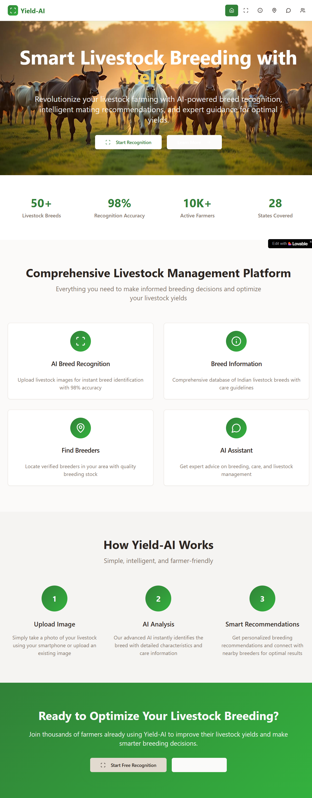
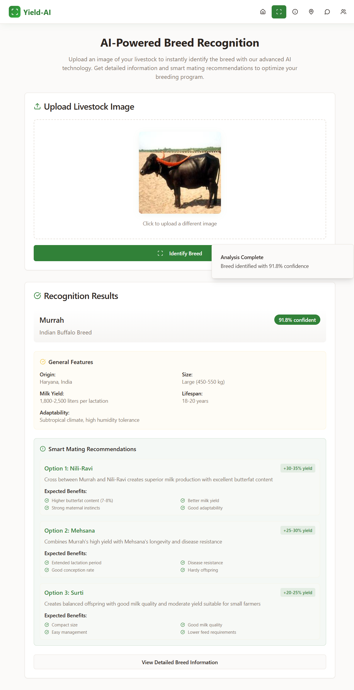

## Project info
💡 Project Overview

The Yeald-AI is an AI-powered web application that can classify cow and buffalo breeds from images.

-This project addresses real-world challenges such as:
-Rapid identification of animal breeds for farmers, breeders, and veterinarians.
-Avoiding misclassification of non-animal images using an “unknown” class.
-A unified, easy-to-use interactive web interface .

🔑 Key Features

🐄 Cow Breed Classification: Sahiwal, Jersey, Red Sindhi, and more.
🐃 Buffalo Breed Classification: Murrah, Jaffarabadi, Bhadawari, etc.
⚠️ Unknown Class Detection: Detects humans, random objects, and non-target animals.
🖼️ Interactive Web App: Upload an image and see the prediction instantly.
🔍 Object Detection: Pre-checks if a cow or buffalo is present before breed classification and recommendation.

Prototype images:
 .png>) .png>) .png>) .png>) 


**URL**:[https://cow-connect-yeildai.lovable.app/]


**Use your preferred IDE**

If you want to work locally using your own IDE, you can clone this repo and push changes. Pushed changes will also be reflected in Lovable.

The only requirement is having Node.js & npm installed - [install with nvm](https://github.com/nvm-sh/nvm#installing-and-updating)

Follow these steps:

```sh
# Step 1: Clone the repository using the project's Git URL.
git clone <YOUR_GIT_URL>

# Step 2: Navigate to the project directory.
cd <YOUR_PROJECT_NAME>

# Step 3: Install the necessary dependencies.
npm i

# Step 4: Start the development server with auto-reloading and an instant preview.
npm run dev
```

**Edit a file directly in GitHub**

- Navigate to the desired file(s).
- Click the "Edit" button (pencil icon) at the top right of the file view.
- Make your changes and commit the changes.

**Use GitHub Codespaces**

- Navigate to the main page of your repository.
- Click on the "Code" button (green button) near the top right.
- Select the "Codespaces" tab.
- Click on "New codespace" to launch a new Codespace environment.
- Edit files directly within the Codespace and commit and push your changes once you're done.

## What technologies are used for this project?

This project is built with:

- Vite
- TypeScript
- React
- shadcn-ui
- Tailwind CSS

